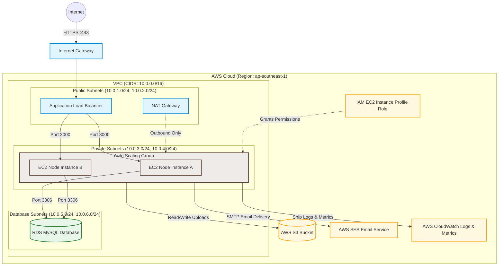

# AWS SaaS Architecture Report & Deployment Guide

This document presents the cloud architecture design and deployment guide for **Restauranteur**, a multi-tenant SaaS Point-of-Sale (POS) platform. The architecture leverages AWS managed services to ensure security, high availability, cost efficiency, and automated scaling.

---

## 1. AWS Cloud Architecture Diagram

The diagram below illustrates the production network topology, security groups, compute routing, database subnets, and integration with AWS S3, SES, and CloudWatch.



---

## 2. Component Design & AWS Services

### 2.1 Networking & Security Groups
The platform is deployed inside a dedicated **VPC** (Virtual Private Cloud) split across two Availability Zones (AZs) for high availability:
- **Public Subnets**: Host the Application Load Balancer (ALB) and NAT Gateways. Directly accessible from the internet.
- **Private Subnets**: Host the backend EC2 server instances. They are isolated from direct internet access; outbound requests (e.g., calling Stripe APIs, downloading updates) route through the NAT Gateways.
- **Isolated Subnets**: Host the AWS RDS MySQL database. They have no route to the internet and can only receive traffic from the private compute subnets.

#### Security Group Matrix (Firewall Rules)
1. **Load Balancer SG**:
   - Inbound: Allow `HTTP (80)` and `HTTPS (443)` from `0.0.0.0/0` (anywhere).
   - Outbound: Allow `Port 3000` to the Backend App SG.
2. **Backend App SG**:
   - Inbound: Allow `Port 3000` ONLY from the Load Balancer SG.
   - Outbound: Allow MySQL `Port 3306` to the Database SG; allow outbound HTTP/HTTPS via NAT Gateway.
3. **Database SG**:
   - Inbound: Allow `Port 3306` ONLY from the Backend App SG.
   - Outbound: Restrict all outbound traffic.

---

### 2.2 Database Multi-Tenancy Design (Option A: Relational RDS)
To meet the SaaS requirement, a **Shared Database, Shared Schema** strategy is used. This is the most cost-effective and scale-friendly model for standard SaaS applications.

```
+------------------------------------+
|             tenants                |
+------------------------------------+
| id (PK) | name | is_active | ...   |
+------------------------------------+
       |
       | 1-to-many
       +-----------------------+-----------------------+
       |                       |                       |
+------v-------------+  +------v-------------+  +------v-------------+
|       users        |  |     menu_items     |  |       orders       |
+--------------------+  +--------------------+  +--------------------+
| username (PK)      |  | id (PK)            |  | id (PK)            |
| password           |  | title              |  | status             |
| role (admin/user)  |  | price              |  | date               |
| tenant_id (FK)     |  | tenant_id (FK)     |  | tenant_id (FK)     |
+--------------------+  +--------------------+  +--------------------+
```

#### Enforcing Tenant-Level Isolation
1. **Multiple Users per Tenant**: The `users` table contains a foreign key `tenant_id` referring to the `tenants` table. Multiple employees (with different roles: `admin` or `user`) can belong to the same restaurant tenant.
2. **Secure Context Retrieval**: When a user logs in, their JWT token securely contains their `tenant_id`. Every API request must pass through an authentication middleware that decodes the JWT and attaches `req.user.tenant_id` to the request context.
3. **Query Filtering**: All database queries strictly append a filter on `tenant_id`. For example:
   ```sql
   -- Fetching Menu Items (backend/src/services/menu_item.service.js)
   SELECT id, title, price, category FROM menu_items 
   WHERE tenant_id = ?;
   
   -- Fetching Orders (backend/src/services/orders.service.js)
   SELECT id, date, status, total FROM orders 
   WHERE tenant_id = ?;
   ```
   Because the query parameter `?` is supplied directly from the authenticated session context (`req.user.tenant_id`), a tenant can **never** query or access another tenant's data.

---

### 2.3 Compute Services (Elastic Beanstalk)
The backend Node.js application is deployed using **AWS Elastic Beanstalk (Web Server Environment)**.
- **Auto Scaling**: Configured to scale between 2 and 4 EC2 instances based on average CPU Utilization (e.g., scale out if CPU exceeds 70%, scale in if CPU falls below 30%).
- **Load Balancing**: The ALB distributes incoming HTTPS traffic across active EC2 instances in different Availability Zones, performing automated health checks (`/` endpoint returning `⚡️`).

---

### 2.4 Storage Services (AWS S3)
To enable multi-instance scaling, local filesystem uploads are redirected to **AWS S3**.
- A bucket (e.g., `restauranteur-saas-media`) stores static assets like tenant store images and menu item photos.
- The storage utility (`backend/src/utils/storage.js`) dynamically routes uploads to S3 when credentials are set, returning the public S3 URL (`https://bucket-name.s3.region.amazonaws.com/public/...`).

---

### 2.5 Identity & Access Management (IAM)
The application adheres to the **Principle of Least Privilege**:
- An **IAM Role for EC2** is created and attached to the Elastic Beanstalk instance profile.
- This role grants write and delete permissions strictly to the S3 bucket:
  ```json
  {
    "Version": "2012-10-17",
    "Statement": [
      {
        "Effect": "Allow",
        "Action": [
          "s3:PutObject",
          "s3:PutObjectAcl",
          "s3:DeleteObject"
        ],
        "Resource": "arn:aws:s3:::restauranteur-saas-media/*"
      }
    ]
  }
  ```
- No long-lived AWS secret access keys are stored in the EC2 instance environment variables. The SDK automatically resolves credentials using the attached EC2 IAM Role.

---

### 2.6 Email Integration (AWS SES)
The transaction receipt flow uses **AWS SES (Simple Email Service)**.
- A verified domain or email address is configured in AWS SES.
- SES provides an SMTP endpoint (e.g., `email-smtp.us-east-1.amazonaws.com` on port `587`).
- Credentials are created in SES and securely populated into the backend environment variables (`SMTP_HOST`, `SMTP_PORT`, `SMTP_EMAIL`, `SMTP_PASSWORD`).
- Receipts are transmitted via `nodemailer` using secure SMTP connection.

---

### 2.7 Monitoring & Logging (AWS CloudWatch)
- **Application Logs**: Elastic Beanstalk automatically integrates with CloudWatch Logs to stream Node.js console output (`stdout`/`stderr`) and web access logs.
- **Metrics**: CloudWatch tracks metrics such as CPU Utilization, Network In/Out, and ALB Request Count.
- **Alarms**: A CloudWatch Alarm is configured to send notifications (via SNS) if CPU utilization exceeds 85% or if the ALB reports a high rate of `5XX` HTTP server errors.

---

## 3. Hướng dẫn triển khai chi tiết trên AWS Console

Dưới đây là hướng dẫn từng bước (click-by-click) trên giao diện quản trị AWS Console để xây dựng hệ thống mạng, cơ sở dữ liệu, máy chủ, quyền truy cập và giám sát cho ứng dụng.

---

### BƯỚC 1: Cấu hình Mạng (VPC, Subnets, Gateways, Route Tables)

Hệ thống mạng sẽ có 1 VPC chia làm 6 Subnets nằm trên 2 Availability Zones (AZ-A và AZ-B) để đảm bảo tính sẵn sàng cao.

#### 1. Tạo VPC
1. Truy cập **VPC Console**. Ở menu bên trái chọn **Your VPCs** -> nhấn **Create VPC**.
2. Chọn **VPC only**.
3. Điền thông tin:
   - **Name tag**: `restauranteur-vpc`
   - **IPv4 CIDR block**: `10.0.0.0/16`
4. Giữ nguyên các cài đặt khác và nhấn **Create VPC**.

#### 2. Tạo Subnets (Phân mạng con)
Truy cập **Subnets** ở menu trái -> nhấn **Create subnet**. Chọn VPC là `restauranteur-vpc` và tạo lần lượt 6 subnets sau:

| Subnet Name | Availability Zone | IPv4 CIDR Block | Loại Subnet (Mục đích) |
| :--- | :--- | :--- | :--- |
| `public-subnet-1a` | us-east-1a (hoặc ap-southeast-1a) | `10.0.1.0/24` | Public (ALB, NAT Gateway) |
| `public-subnet-1b` | us-east-1b (hoặc ap-southeast-1b) | `10.0.2.0/24` | Public (ALB, NAT Gateway) |
| `private-subnet-1a` | us-east-1a (hoặc ap-southeast-1a) | `10.0.3.0/24` | Private (EC2 Web Server) |
| `private-subnet-1b` | us-east-1b (hoặc ap-southeast-1b) | `10.0.4.0/24` | Private (EC2 Web Server) |
| `database-subnet-1a` | us-east-1a (hoặc ap-southeast-1a) | `10.0.5.0/24` | Isolated (RDS Database) |
| `database-subnet-1b` | us-east-1b (hoặc ap-southeast-1b) | `10.0.6.0/24` | Isolated (RDS Database) |

*Nhấn **Add new subnet** sau mỗi subnet để điền hết 6 cái rồi nhấn **Create subnet**.*

#### 3. Tạo Internet Gateway (Cổng Internet)
1. Ở menu trái chọn **Internet Gateways** -> nhấn **Create internet gateway**.
2. Đặt tên: `restauranteur-igw` -> nhấn **Create internet gateway**.
3. Sau khi tạo xong, nhấn nút **Actions** ở góc trên bên phải -> chọn **Attach to VPC**.
4. Chọn VPC `restauranteur-vpc` -> nhấn **Attach internet gateway**.

#### 4. Tạo NAT Gateway (Cấp internet một chiều cho Private Subnets)
1. Chọn **NAT Gateways** ở menu trái -> nhấn **Create NAT gateway**.
2. Đặt tên: `restauranteur-nat-gw`
3. Chọn Subnet: `public-subnet-1a` *(Phải đặt ở public subnet)*.
4. Ở mục Connectivity type chọn **Public**, mục Elastic IP allocation nhấn **Allocate Elastic IP**.
5. Nhấn **Create NAT gateway** (chờ 1-2 phút để NAT chuyển sang trạng thái *Available*).

#### 5. Cấu hình Route Tables (Bảng định tuyến)
Mặc định VPC sẽ có 1 bảng định tuyến chính (Main Route Table). Ta sẽ tạo thêm các bảng khác để phân chia quyền truy cập mạng.

1. **Bảng định tuyến cho Public Subnets (Cho phép ra Internet qua IGW)**:
   - Chọn **Route tables** -> nhấn **Create route table**. Đặt tên: `public-rt` -> Chọn VPC `restauranteur-vpc` -> Nhấn **Create**.
   - Chọn tab **Routes** -> **Edit routes** -> Nhấn **Add route**.
   - Điền Destination: `0.0.0.0/0`, Target: chọn **Internet Gateway** -> chọn `restauranteur-igw` -> Nhấn **Save changes**.
   - Chọn tab **Subnet associations** -> **Edit subnet associations** -> Tích chọn `public-subnet-1a` và `public-subnet-1b` -> Nhấn **Save associations**.

2. **Bảng định tuyến cho Private Subnets (Ra Internet qua NAT Gateway)**:
   - Nhấn **Create route table**. Đặt tên: `private-rt` -> Chọn VPC `restauranteur-vpc` -> Nhấn **Create**.
   - Chọn tab **Routes** -> **Edit routes** -> Nhấn **Add route**.
   - Điền Destination: `0.0.0.0/0`, Target: chọn **NAT Gateway** -> chọn `restauranteur-nat-gw` -> Nhấn **Save changes**.
   - Chọn tab **Subnet associations** -> **Edit subnet associations** -> Tích chọn `private-subnet-1a` và `private-subnet-1b` -> Nhấn **Save associations**.

3. **Bảng định tuyến cho Database Subnets (Bị cô lập hoàn toàn)**:
   - Bảng định tuyến mặc định của VPC (Main Route Table) không cấu hình bất kỳ route nào ra ngoài. Ta giữ nguyên và chỉ cần đảm bảo gán `database-subnet-1a` và `database-subnet-1b` vào bảng này.

---

### BƯỚC 2: Cấu hình IAM Roles (Phân quyền bảo mật)

Tạo một Role để gán cho EC2 (hoặc Elastic Beanstalk) để máy chủ có quyền ghi/xóa file trên S3 và đẩy log lên CloudWatch mà không cần lưu trữ Access Key cứng trong code.

1. Truy cập **IAM Console**. Ở menu bên trái chọn **Roles** -> nhấn **Create role**.
2. **Select trusted entity**: Chọn **AWS service**, mục *Service or use case* chọn **EC2**. Nhấn **Next**.
3. **Add permissions**: Tìm kiếm và tích chọn các Policy sau:
   - `AmazonS3FullAccess` (Hoặc tạo Policy tùy chỉnh giới hạn chỉ bucket `restauranteur-saas-media`)
   - `CloudWatchAgentServerPolicy` (Cho phép máy chủ ghi log lên CloudWatch)
4. Nhấn **Next**.
5. **Role details**: Đặt tên Role là `RestauranteurEC2Role`.
6. Nhấn **Create role**.

---

### BƯỚC 3: Thiết lập RDS Database (MySQL Multi-Tenant)

#### 1. Tạo DB Subnet Group
1. Truy cập **RDS Console**. Chọn **Subnet groups** ở menu trái -> nhấn **Create DB Subnet Group**.
2. Đặt tên: `restauranteur-db-subnet-group`.
3. Chọn VPC: `restauranteur-vpc`.
4. Mục Availability Zones: Chọn 2 AZs mà bạn đã tạo Subnet (ví dụ: `us-east-1a` và `us-east-1b`).
5. Mục Subnets: Chọn chính xác 2 dải mạng Isolated của database (`10.0.5.0/24` và `10.0.6.0/24`).
6. Nhấn **Create**.

#### 2. Tạo Database
1. Chọn **Databases** ở menu trái -> nhấn **Create database**.
2. Chọn **Standard create** và chọn **MySQL**.
3. Mục **Templates**: Chọn **Free Tier** để tiết kiệm chi phí.
4. Cấu hình:
   - **DB instance identifier**: `restauranteur-db`
   - **Master username**: `admin`
   - **Master password**: Nhập mật khẩu bảo mật cao (lưu lại thông tin này).
5. **Connectivity**:
   - Chọn VPC: `restauranteur-vpc`.
   - Chọn DB Subnet Group: `restauranteur-db-subnet-group`.
   - **Public access**: Chọn **No** (Chỉ cho phép kết nối nội bộ).
   - **VPC Security Group**: Chọn **Create new**, đặt tên là `restauranteur-db-sg`.
6. Nhấn **Create database** (quá trình khởi tạo mất khoảng 5-10 phút).
7. Khi DB chuyển sang trạng thái *Available*, ghi lại **Endpoint** ở tab *Connectivity & security*.

#### 3. Phân quyền truy cập Database (Cấu hình Security Group)
1. Click vào Security Group `restauranteur-db-sg`.
2. Chọn tab **Inbound rules** -> nhấn **Edit inbound rules**.
3. Xóa các rule mặc định và nhấn **Add rule**:
   - **Type**: chọn `MYSQL/Aurora` (Port `3306`).
   - **Source**: Chọn Custom, sau đó nhập/chọn Security Group của máy chủ EC2 (hoặc Elastic Beanstalk). Việc này đảm bảo **chỉ máy chủ backend mới truy cập được vào Database**.
4. Nhấn **Save rules**.

---

### BƯỚC 4: Thiết lập Storage (AWS S3)

1. Truy cập **S3 Console** -> nhấn **Create bucket**.
2. Đặt tên: `restauranteur-saas-media` (Tên phải là độc nhất toàn cầu).
3. Chọn Region giống với VPC của bạn.
4. Mục **Object Ownership**: Tích chọn **ACLs enabled** và chọn **Bucket owner preferred**.
5. Mục **Block Public Access settings for this bucket**:
   - **Bỏ tích** ở mục **Block all public access** (vì ảnh của menu món ăn và logo nhà hàng cần hiển thị công khai trên ứng dụng web).
   - Tích chọn ô cảnh báo xác nhận ở dưới cùng.
6. Nhấn **Create bucket**.

---

### BƯỚC 5: Triển khai ứng dụng (EC2 & ALB)

Có 2 cách làm: Dùng **Elastic Beanstalk** (Khuyên dùng vì nó tự động quản lý EC2, ALB, Autoscaling và cập nhật phiên bản rất dễ) hoặc chạy **EC2 độc lập** bằng tay.

#### CÁCH 1: Dùng AWS Elastic Beanstalk (Tự động & Khuyên dùng)
1. Truy cập **Elastic Beanstalk Console** -> nhấn **Create application**.
2. Đặt tên App: `restauranteur-backend`.
3. **Platform**: Chọn **Node.js**, giữ nguyên phiên bản mặc định.
4. **Application code**: Chọn **Upload your code** -> Nén thư mục `backend` (loại bỏ `node_modules` và file `.env`) thành file `.zip` rồi tải lên.
5. Nhấn **Configure more options**:
   - **Network**: Chọn `restauranteur-vpc`. Gán Load Balancer vào **Public Subnets**, gán EC2 vào **Private Subnets**.
   - **Security**: Chọn IAM Instance Profile là `RestauranteurEC2Role` đã tạo ở Bước 2.
   - **Capacity**: Chọn **Load balanced** (để kích hoạt Auto Scaling và ALB). Cấu hình Min: 2, Max: 4 instances.
   - **Software**: Ở phần *Environment properties*, điền tất cả các tham số cấu hình `.env` (như `DATABASE_URL` kết nối tới RDS Endpoint, JWT Secret, cấu hình email SES SMTP và `S3_BUCKET_NAME`).
6. Nhấn **Create**. Hệ thống sẽ tự động tạo ALB, EC2, Autoscaling. Bạn chỉ cần lấy URL Beanstalk cấp để cấu hình cho frontend.

#### CÁCH 2: Tạo máy chủ EC2 thủ công (Manual EC2)
1. Truy cập **EC2 Console** -> nhấn **Launch instance**.
2. Đặt tên: `restauranteur-app-server`.
3. **AMI**: Chọn **Amazon Linux 2023** (Free tier eligible).
4. **Key pair**: Tạo key pair mới để SSH vào máy chủ.
5. **Network settings**:
   - Chọn VPC: `restauranteur-vpc`.
   - Chọn Subnet: `private-subnet-1a` (hoặc public-subnet-1a nếu bạn muốn test nhanh không qua ALB, nhưng thực tế phải đặt ở private).
   - **Auto-assign public IP**: Chọn **Disable** (nếu dùng private/ALB) hoặc **Enable** (nếu làm lab đơn giản trực tiếp).
   - **Security Group**: Tạo SG mới tên `restauranteur-ec2-sg`. Thêm rule: Cho phép port `3000` (port chạy backend) từ ALB hoặc từ everywhere (nếu test trực tiếp).
6. **Advanced details**:
   - **IAM instance profile**: Chọn `RestauranteurEC2Role` đã tạo ở Bước 2.
   - **User data**: Dán đoạn script dưới đây để tự động cài đặt Node.js khi khởi động máy:
     ```bash
     #!/bin/bash
     sudo dnf update -y
     sudo dnf install -y git
     curl -sL https://rpm.nodesource.com/setup_18.x | sudo bash -
     sudo dnf install -y nodejs
     ```
7. Nhấn **Launch instance**.

---

### BƯỚC 6: Thiết lập Email (Amazon SES)

1. Truy cập **Amazon SES Console**.
2. Chọn **Verified identities** ở menu trái -> nhấn **Create identity**.
3. Chọn **Email address**, nhập địa chỉ email của bạn (ví dụ: `you@domain.com`) -> nhấn **Create identity**.
4. AWS sẽ gửi một email xác thực. Hãy mở hộp thư của bạn và nhấn link xác nhận.
5. Ở menu trái chọn **SMTP Settings** -> nhấn **Create SMTP credentials**.
6. Đặt tên và nhấn **Create**. Hãy copy lại **SMTP Username** và **SMTP Password** hiển thị trên màn hình.
7. Cập nhật các thông tin này vào biến môi trường của backend:
   - `SMTP_HOST`: `email-smtp.us-east-1.amazonaws.com` (tùy thuộc vào Region của bạn)
   - `SMTP_PORT`: `587`
   - `SMTP_EMAIL`: Email bạn vừa xác thực thành công.
   - `SMTP_PASSWORD`: SMTP Password vừa tạo.

---

### BƯỚC 7: Cấu hình Giám sát & Cảnh báo (AWS CloudWatch)

#### 1. Xem Log ứng dụng
Nếu dùng Elastic Beanstalk:
1. Truy cập **CloudWatch Console** -> chọn **Logs** -> **Log groups**.
2. Tìm log group có tên `/aws/elasticbeanstalk/restauranteur-backend/...` để theo dõi toàn bộ log chạy thực tế của server Express.

#### 2. Tạo cảnh báo quá tải CPU (CPU Alarm)
1. Truy cập **CloudWatch Console** -> chọn **Alarms** -> **All alarms** -> nhấn **Create alarm**.
2. Nhấn **Select metric** -> chọn **EC2** -> **Per-Instance Metrics**.
3. Tìm kiếm tên máy chủ của bạn và tích chọn metric **CPUUtilization** -> nhấn **Select metric**.
4. Cấu hình điều kiện cảnh báo:
   - **Period**: chọn `5 minutes`.
   - **Threshold type**: Static.
   - **Whenever CPUUtilization is...**: chọn **Greater/Equal** -> điền `80` (Cảnh báo khi CPU >= 80%).
5. Nhấn **Next**.
6. Cấu hình hành động gửi thông báo (**Notification**):
   - Chọn **In alarm**.
   - Chọn **Create new SNS topic**, đặt tên topic là `cpu-alert-topic` và nhập email của bạn vào để nhận thư cảnh báo.
   - Nhấn **Create topic**.
7. Nhấn **Next**, đặt tên cảnh báo: `High-CPU-Warning` -> nhấn **Create alarm**.

---

### BƯỚC 8: Triển khai Frontend (React SPA) lên AWS S3 + CloudFront

Để triển khai giao diện React tĩnh một cách tối ưu về chi phí và tốc độ, ta sẽ upload build folder lên S3 và phân phối qua mạng lưới CDN CloudFront.

#### 1. Build Production Frontend ở Local
1. Ở code local, cập nhật file `frontend/.env.local` hướng API về máy chủ backend vừa tạo trên AWS:
   ```env
   VITE_BACKEND=http://<beanstalk-domain-của-bạn>/api/v1
   VITE_BACKEND_SOCKET_IO=http://<beanstalk-domain-của-bạn>
   VITE_BACKEND_IMAGES_BASE_URL=
   VITE_FRONTEND_DOMAIN=https://<domain-distribution-của-cloudfront-sau-khi-tạo>
   ```
2. Mở terminal tại thư mục `frontend` và chạy lệnh build:
   ```bash
   npm run build
   ```
   Lệnh này tạo ra thư mục `dist` chứa các file HTML/JS/CSS tĩnh của React.

#### 2. Tạo S3 Bucket lưu trữ Frontend
1. Truy cập **S3 Console** -> nhấn **Create bucket**.
2. Đặt tên: `restauranteur-frontend` (Tên độc nhất toàn cầu).
3. Chọn Region trùng với VPC của bạn.
4. Giữ nguyên mặc định **Block all public access** (vì ta sẽ dùng CloudFront OAC để truy cập an toàn, không cần mở public trực tiếp từ S3).
5. Nhấn **Create bucket**.
6. Sau khi tạo xong, click vào bucket, chọn tab **Properties** -> kéo xuống cùng tìm **Static website hosting** -> nhấn **Edit**.
   - Chọn **Enable**.
   - **Index document**: điền `index.html`.
   - **Error document**: điền `index.html` (rất quan trọng đối với React Router để tránh lỗi 404 khi F5 trang).
   - Nhấn **Save changes**.
7. Chọn tab **Objects** -> nhấn **Upload** -> Kéo thả toàn bộ nội dung *bên trong* thư mục `frontend/dist` vào đây và tải lên.

#### 3. Cấu hình CDN CloudFront (Bảo mật & Tăng tốc)
1. Truy cập **CloudFront Console** -> nhấn **Create distribution**.
2. **Origin domain**: Chọn S3 website endpoint của bucket `restauranteur-frontend` (ví dụ: `restauranteur-frontend.s3-website...`).
3. **Origin access**: Chọn **Origin access control settings (recommended)** để bảo mật bucket:
   - Click **Create control setting** -> đặt tên mặc định -> nhấn **Create**.
4. **Viewer protocol policy**: Chọn **Redirect HTTP to HTTPS** (Bắt buộc dùng HTTPS bảo mật).
5. **Web Application Firewall (WAF)**: Chọn **Do not enable security protections** để tránh phát sinh chi phí trong quá trình học tập.
6. **Default root object**: Điền `index.html`.
7. Nhấn **Create distribution** (Chờ khoảng 3-5 phút để khởi tạo).
8. **Cập nhật S3 Bucket Policy (Cho phép CloudFront đọc file)**:
   - Khi distribution tạo xong, CloudFront sẽ hiển thị một banner màu vàng yêu cầu cập nhật Bucket Policy trên S3. Nhấn **Copy policy**.
   - Quay lại **S3 Console** -> vào bucket `restauranteur-frontend` -> chọn tab **Permissions** -> tìm **Bucket policy** -> nhấn **Edit** -> Paste đoạn policy vừa copy vào -> Nhấn **Save changes**.
9. Lấy tên miền CloudFront cấp (ví dụ: `d1234567.cloudfront.net`) để truy cập vào hệ thống SaaS POS hoạt động thực tế của bạn!

